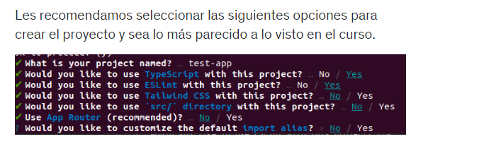

# https://nextjs.org/

## npx create-next-app first-steps
# npm run dev

## https://vercel.com/

## https://gist.github.com/Klerith/b5459b1daa4fc6d539ac373855c98039

# comandos linux

FROM node:16-alpine

RUN mkdir -p /app

WORKDIR /app

COPY package.json /app

RUN yarn install

COPY . /app

RUN yarn build

# USER nextjs

EXPOSE 3000

CMD [ "yarn", "start" ]

/// para correr la imagen 
docker build -t nombrecualquiera .

/// levantar la imagen docker desde la terminal
/// docker run --name=nombreCualquiera -p puertolocal:puertoImagen nombreImagenaCorrer
docker run --name=next-app -p 3000:3000 nextjs-initial

